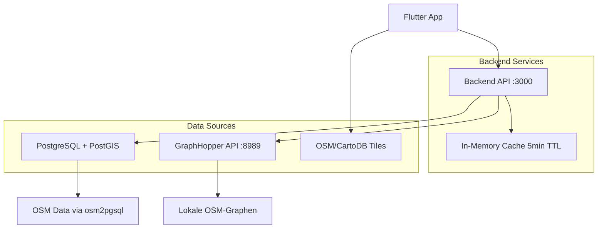

# Navigatio 🗺️

[](https://flutter.dev/)
[](https://nodejs.org/)
[](https://postgresql.org/)
[](https://graphhopper.com/)
[](LICENSE)

> Eine fortschrittliche Flutter-Navigation-App mit vollständiger ÖPNV-Integration für Berlin, GraphHopper-Routing und OpenStreetMap-Integration über PostgreSQL/PostGIS.

## 🌟 Übersicht

**Navigatio** ist eine hochmoderne Navigationsanwendung, die speziell für die öffentlichen Verkehrsmittel Berlins entwickelt wurde. Sie kombiniert echte OSM-Daten mit GraphHopper-Routing, um präzise Verbindungssuche und Navigation zu bieten.

### 🎯 **Hauptziele**
- **Umfassende ÖPNV-Abdeckung** - Alle Berliner Verkehrsmittel (U-Bahn, S-Bahn, Bus, Tram, Regionalbahn)
- **Moderne Benutzererfahrung** - Intuitive, responsive UI mit Liquid Glass Design
- **Hochperformante Architektur** - Optimierte Datenladung und intelligentes Caching
- **Echte Routing-Funktionalität** - Turn-by-Turn-Navigation mit GraphHopper

## ✨ Features

### 🎨 **Moderne UI/UX**
- **💧 Liquid Glass Design** - Moderne, transparente UI-Elemente mit Blur-Effekten
- **📱 Edge-to-Edge Display** - Vollbild-Kartenerlebnis ohne störende Ränder
- **🎬 Smooth Animations** - Flüssige 60fps Zoom- und Bewegungsanimationen
- **🎈 Floating Controls** - Schwebende Steuerelemente wie in professionellen Apps
- **🌙 Hell/Dunkel Modus** - Dynamische Kartenstile (OSM, CartoDB Dark/Light)
- **📲 Platform-optimiert** - Native iOS/Android Performance

### 🚊 **ÖPNV-Integration**
- **🔄 Echtzeitdaten** - Direkte Integration mit PostgreSQL/PostGIS-Datenbank
- **🗺️ Vollständige Netzabdeckung** - Visualisierung aller Berliner Verkehrslinien
- **🎨 Intelligente Farbkodierung**:
  - 🔵 **U-Bahn**: Blau (subway/underground)
  - 🟢 **S-Bahn**: Grün (light_rail/suburban)
  - 🟣 **Bus**: Lila (bus/coach)
  - 🩷 **Tram**: Rosa (tram/streetcar)
  - 🔴 **Regionalbahn**: Rot (railway/rail)
- **🔍 Interaktive Station Search** - TypeAhead-Suche mit Autocomplete
- **📍 Präzise Haltestellen** - Genaue GPS-Koordinaten aller Stationen

### 🛤️ **GraphHopper Routing Engine**
- **🎯 Multi-Modal Routing** - Fußweg + ÖPNV kombiniert
- **⚡ Hochperformant** - Lokale GraphHopper-Instanz für schnelle Berechnungen
- **🗺️ Detaillierte Wegbeschreibungen** - Turn-by-Turn-Navigation
- **📏 Präzise Berechnungen** - Distanzen, Zeiten und Routenoptimierung
- **🚶‍♂️ Verschiedene Profile** - Fußweg, Fahrrad, Auto-Integration möglich

### 🚀 **Performance & Optimierung**
- **⚡ Smart Caching** - 5-Minuten In-Memory-Cache für API-Abfragen
- **🎯 Intelligente Bounding Boxes** - Zoom-basiertes, adaptives Laden von Daten
- **⏱️ Debounced Loading** - Optimierte Datenabfragen beim Kartenbewegen
- **🧠 Memory Management** - Automatische Bereinigung und Garbage Collection
- **📊 Cache Statistics** - Überwachung von Hit-Rates und Performance-Metriken

## 🏗️ Architektur

```
navigatio/
├── 📱 frontend/                    # Flutter Mobile App (1066 lines main.dart)
│   ├── 📂 lib/
│   │   ├── 🏗️  main.dart          # App-Entry & Edge-to-Edge Setup
│   │   ├── 📊 models/             # Datenmodelle
│   │   │   ├── map_styles.dart    # Kartenstil-Definitionen
│   │   │   ├── station_models.dart # ÖPNV-Station-Models
│   │   │   └── route_models.dart   # GraphHopper-Route-Models
│   │   ├── 🔧 services/           # API-Services & Business Logic
│   │   │   └── station_service.dart # Backend-Kommunikation
│   │   └── 🎨 widgets/            # UI-Komponenten
│   │       ├── connection_search_widget.dart # Station Search
│   │       └── route_details_sheet.dart # Route-Details
│   ├── 📦 pubspec.yaml            # Flutter Dependencies (flutter_map, geolocator, etc.)
│   └── 🤖 android/ios/web/        # Platform-spezifische Konfiguration
├── 🖥️  backend/                    # Node.js API Server (736 lines server.js)
│   ├── ⚙️  server.js               # Express Server + GraphHopper + PostGIS
│   ├── 📦 package.json            # Node.js Dependencies (express, pg, cors, axios)
│   ├── 🔐 .env.example            # Umgebungsvariablen-Vorlage
│   └── 📖 README.md               # Backend-spezifische Dokumentation
├── 🗄️  GTFS/                       # GTFS-Referenzdaten (Berliner Verkehrsbetriebe)
│   ├── 🚌 routes.txt              # Verkehrslinien-Definitionen
│   ├── 🏃 stop_times.txt          # Fahrzeiten und Haltestellen
│   ├── 🚏 stops.txt               # Haltestellenverzeichnis
│   └── 📅 calendar.txt            # Betriebszeiten und Kalender
├── 📋 GRAPHHOPPER_INTEGRATION.md  # Detaillierte GraphHopper-Setup-Anleitung
├── 📋 GRAPHHOPPER_PT_SETUP.md     # ÖPNV-spezifische GraphHopper-Konfiguration
└── 🗄️  gtfs_dump.dump             # PostgreSQL-Backup der GTFS-Daten
```

### 🔄 **Datenfluss-Architektur**



## 🛠️ Installation & Setup

### **Voraussetzungen**

| Komponente | Version | Zweck |
|------------|---------|-------|
| 📱 Flutter SDK | >=3.9.2 | Mobile App Framework |
| 🚀 Node.js | >=16.0.0 | Backend API Server |
| 🗄️ PostgreSQL | >=13.0 | Hauptdatenbank |
| 🌍 PostGIS | >=3.0 | Geografische Erweiterung |
| 🛤️ GraphHopper | >=8.0 | Routing Engine |
| 🗺️ OSM-Daten | Berlin | Kartenbasis (osm2pgsql) |

### **1. Repository klonen**

```bash
git clone https://github.com/your-username/navigatio.git
cd navigatio
```

### **2. Backend Setup**

```bash
cd backend
npm install

# Umgebungsvariablen konfigurieren
cp .env.example .env
```

**Konfiguriere `.env`:**
```env
# PostgreSQL Datenbank (OSM Data)
DB_HOST=localhost
DB_PORT=5432
DB_NAME=osm2pgsql
DB_USER=your_username
DB_PASSWORD=your_password

# Server Konfiguration
PORT=3000
NODE_ENV=development

# GraphHopper API
GRAPHHOPPER_URL=http://localhost:8989
GRAPHHOPPER_PROFILE=foot
USE_PUBLIC_TRANSPORT=true
```

**Datenbank-Berechtigungen setzen:**
```sql
-- PostgreSQL Console
GRANT SELECT ON ALL TABLES IN SCHEMA public TO your_username;
GRANT USAGE ON SCHEMA public TO your_username;
```

**Server starten:**
```bash
npm start        # Produktion
npm run dev      # Development mit nodemon
```

### **3. GraphHopper Setup**

Siehe detaillierte Anleitung: [GRAPHHOPPER_INTEGRATION.md](GRAPHHOPPER_INTEGRATION.md)

**Quick Start:**
```bash
# GraphHopper herunterladen
wget https://repo1.maven.org/maven2/com/graphhopper/graphhopper-web/8.0/graphhopper-web-8.0.jar

# Berlin OSM-Daten herunterladen  
wget https://download.geofabrik.de/europe/germany/berlin-latest.osm.pbf

# GraphHopper starten
java -Ddw.graphhopper.datareader.file=berlin-latest.osm.pbf \
     -Ddw.graphhopper.graph.location=berlin-graph \
     -jar graphhopper-web-8.0.jar server config.yml
```

### **4. Frontend Setup**

```bash
cd frontend
flutter pub get

# Abhängigkeiten prüfen
flutter doctor

# App starten
flutter run                    # Debug Mode
flutter run --release         # Release Mode  
flutter run -d web-server     # Web Development
```

## 📡 API Documentation

### **🚊 ÖPNV Routes**
```http
GET /api/routes
```

**Parameter:**
- `west`, `south`, `east`, `north` - Bounding Box Koordinaten
- Beispiel: `?west=13.2&south=52.4&east=13.5&north=52.6`

**Response:**
```json
{
  "routes": [
    {
      "name": "U7",
      "route_type": "subway", 
      "color": "#3366CC",
      "geometry": "LINESTRING(...)"
    }
  ],
  "cache_info": {
    "hit": false,
    "key": "routes_132_524_135_526",
    "ttl": 300
  }
}
```

### **🚏 Stationen Suche**
```http
GET /api/stations/search
```

**Parameter:**
- `q` - Suchbegriff (mindestens 2 Zeichen)
- `limit` - Anzahl Ergebnisse (default: 10)

**Response:**
```json
{
  "stations": [
    {
      "name": "Alexanderplatz",
      "lat": 52.5219,
      "lon": 13.4132,
      "types": ["subway", "bus", "tram"]
    }
  ]
}
```

### **🛤️ GraphHopper Routing**
```http
POST /api/route
```

**Request Body:**
```json
{
  "from": {"lat": 52.5219, "lon": 13.4132},
  "to": {"lat": 52.4963, "lon": 13.4445},
  "profile": "foot"
}
```

**Response:**
```json
{
  "route": {
    "distance": 2.1,
    "time": 1260,
    "instructions": [...],
    "geometry": "LINESTRING(...)"
  }
}
```

### **⚙️ System Endpoints**
```http
GET /health              # Server-Status
GET /cache/stats         # Cache-Statistiken  
DELETE /cache           # Cache leeren
```

## 🎮 Bedienung

### **📱 App-Navigation**

| Geste | Aktion |
|-------|--------|
| 🤏 **Pinch-to-Zoom** | Karte zoomen |
| 👆 **Single Tap** | Marker-Details anzeigen |
| ✌️ **Two-Finger Pan** | Karte bewegen |
| 🔄 **Rotation** | Karte drehen |

### **🚊 ÖPNV-Modus**
1. **🚂-Button** rechts oben antippen
2. **Verkehrslinien** werden automatisch geladen
3. **Zoomen** für mehr Details
4. **Karte bewegen** - Neue Daten werden adaptiv nachgeladen

### **🔍 Stationen Suche**
1. **Suchfeld** oben antippen
2. **Mindestens 2 Zeichen** eingeben
3. **Autocomplete-Vorschläge** auswählen
4. **Route berechnen** zwischen zwei Stationen

### **🎨 Kartenstile**
- **🌙/☀️-Button** - Zwischen Hell- und Dunkelmodus wechseln
- **OSM Standard** - Klassisches OpenStreetMap
- **CartoDB Light** - Minimalistisch hell
- **CartoDB Dark** - Elegantes Dunkelthema

## 🔧 Technische Details

### **📱 Frontend Tech Stack**
```yaml
flutter: sdk                    # Cross-Platform Framework
flutter_map: ^7.0.2           # Interaktive Karten
latlong2: ^0.9.1              # GPS-Koordinaten-Handling  
geolocator: ^12.0.0           # Geolocation Services
http: ^1.1.0                  # REST API Client
flutter_typeahead: ^5.2.0     # Autocomplete Search
cupertino_icons: ^1.0.8       # iOS-Style Icons
```

### **🖥️ Backend Tech Stack**
```json
{
  "express": "^4.18.2",        // Web Framework
  "pg": "^8.11.3",            // PostgreSQL Client  
  "cors": "^2.8.5",           // Cross-Origin Resource Sharing
  "dotenv": "^16.3.1",        // Environment Variables
  "axios": "^1.13.2",         // HTTP Client (GraphHopper)
  "nodemon": "^3.0.1"         // Development Auto-Restart
}
```

### **🗄️ Datenbank Schema (OSM via osm2pgsql)**

**Tabelle: `planet_osm_line`** (Verkehrslinien)
```sql
SELECT name, route, railway, highway, public_transport, 
       ST_AsText(way) as geometry
FROM planet_osm_line 
WHERE route IN ('subway', 'bus', 'tram', 'light_rail')
   OR railway IN ('subway', 'rail', 'tram');
```

**Tabelle: `planet_osm_point`** (Haltestellen)
```sql  
SELECT name, public_transport, railway, highway,
       ST_Y(way) as lat, ST_X(way) as lon
FROM planet_osm_point
WHERE public_transport IN ('stop_position', 'platform', 'station')
   OR railway IN ('station', 'halt', 'tram_stop');
```

## 🚀 Performance-Optimierungen

### **⚡ Caching-Strategien**

| Typ | TTL | Zweck |
|-----|-----|-------|
| 🗺️ **Route Cache** | 5min | ÖPNV-Linien nach Bounding Box |
| 🏗️ **Station Cache** | 10min | Stationssuche-Ergebnisse |
| 🛤️ **GraphHopper Cache** | 30min | Berechnete Routen |

**Cache-Schlüssel-Format:**
```javascript
// Routes: "routes_{west}_{south}_{east}_{north}" 
const key = `routes_${Math.round(west*10)}_${Math.round(south*10)}_${Math.round(east*10)}_${Math.round(north*10)}`;

// Stations: "stations_{query}_{limit}"
const key = `stations_${query.toLowerCase()}_${limit}`;
```

### **📊 Smart Data Loading**

```javascript
// Adaptive Bounding Box basierend auf Zoom-Level
const buffer = Math.max(0.01, (18 - zoomLevel) * 0.005);
const expandedBounds = {
  west: bounds.west - buffer,
  south: bounds.south - buffer, 
  east: bounds.east + buffer,
  north: bounds.north + buffer
};
```

## 🐛 Troubleshooting

### **❌ Häufige Probleme**

| Problem | Lösung |
|---------|--------|
| 🔴 **"role does not exist"** | PostgreSQL-Benutzer in `.env` prüfen |
| 🔴 **"permission denied"** | `GRANT SELECT` für OSM-Tabellen ausführen |
| 🔴 **"No routes loaded"** | Datenbank-Inhalt und WHERE-Clause prüfen |
| 🔴 **GraphHopper 404** | URL in `.env` und Service-Status prüfen |
| 🔴 **Flutter build fails** | `flutter clean && flutter pub get` |

### **🔍 Debug-Befehle**

```bash
# Backend-Logs mit Details
cd backend && npm run dev

# PostgreSQL Verbindung testen  
psql -U $DB_USER -d $DB_NAME -c "SELECT count(*) FROM planet_osm_line WHERE route='subway';"

# GraphHopper Health Check
curl http://localhost:8989/health

# Flutter Diagnose
flutter doctor -v

# Cache-Status prüfen
curl http://localhost:3000/cache/stats
```

### **📈 Performance Monitoring**

```bash
# Backend-Performance
curl http://localhost:3000/health
# => {"status": "ok", "cache": {"size": 42, "hits": 156, "misses": 23}}

# Memory Usage
ps aux | grep "node\|dart\|flutter"

# Network Traffic  
netstat -an | grep ":3000\|:8989"
```

## 🗺️ Roadmap & Future Features

### **📋 Kurzfristig (Q1 2026)**
- [ ] **🔄 Real-time ÖPNV** - Live-Verspätungen über VBB-API
- [ ] **🌐 Offline-Karten** - Lokale Tile-Speicherung
- [ ] **♿ Accessibility** - Barrierefreie Routenplanung
- [ ] **🚴‍♂️ Bike-Integration** - Fahrrad-Routing mit Leihstationen

### **📋 Mittelfristig (Q2-Q3 2026)**  
- [ ] **🎯 Multi-Modal Routing** - Auto + ÖPNV kombiniert
- [ ] **📱 PWA-Version** - Web-App für Desktop
- [ ] **🔔 Push-Notifications** - Störungsmeldungen und Updates
- [ ] **📊 Analytics Dashboard** - Nutzungsstatistiken

### **📋 Langfristig (Q4 2026+)**
- [ ] **🌍 Multi-City Support** - Hamburg, München, etc.
- [ ] **🤖 AI-Integration** - Intelligente Routenvorschläge
- [ ] **👥 Social Features** - Fahrgemeinschaften und Reviews
- [ ] **🎮 Gamification** - Achievements und Leaderboards

## 🤝 Contributing

### **📝 Entwicklung**

1. **Fork** das Repository
2. **Feature-Branch** erstellen
   ```bash
   git checkout -b feature/amazing-feature
   ```
3. **Changes committen**
   ```bash
   git commit -m 'feat: Add amazing routing feature'
   ```
4. **Branch pushen** 
   ```bash
   git push origin feature/amazing-feature
   ```
5. **Pull Request** öffnen

### **📏 Code-Standards**

- **Flutter**: Dart-Standard mit `flutter analyze`
- **Node.js**: ESLint + Prettier Konfiguration  
- **Git**: Conventional Commits (`feat:`, `fix:`, `docs:`)
- **Testing**: Unit-Tests für kritische Services

### **🧪 Testing**

```bash
# Flutter Tests
cd frontend && flutter test

# Backend Tests  
cd backend && npm test

# Integration Tests
flutter integration_test
```

## 📄 Lizenz

Dieses Projekt ist unter der **MIT-Lizenz** lizenziert. Siehe [LICENSE](LICENSE) für Details.

```
MIT License - Frei für kommerzielle und private Nutzung
Copyright (c) 2026 Dennis - Navigatio Project
```

## 👥 Team & Credits

### **👨‍💻 Entwickler**
- **Dennis** - *Lead Developer & Project Owner*
  - 📧 Email: dennis@navigatio.app
  - 🔗 GitHub: [@dennis](https://github.com/dennis)
  - 🎓 5. Semester Informatik

### **🙏 Danksagungen & Attribution**

| Projekt/Service | Zweck | Lizenz |
|----------------|-------|--------|
| 🗺️ **[OpenStreetMap](https://openstreetmap.org)** | Geodaten-Basis | ODbL |
| 📱 **[Flutter Team](https://flutter.dev)** | Mobile Framework | BSD-3 |
| 🗄️ **[PostGIS](https://postgis.net)** | Spatial Database | GPL-2 |
| 🛤️ **[GraphHopper](https://graphhopper.com)** | Routing Engine | Apache-2 |
| 🚊 **[VBB](https://www.vbb.de)** | GTFS-Daten Berlin | Open Data |
| 🎨 **[CartoDB](https://carto.com)** | Kartenstile | Carto License |

### **📚 Akademischer Kontext**

```
🎓 Hochschule: [Ihre Hochschule]
📘 Kurs: Navigation & Geoinformatik  
📅 Semester: 5. Semester (WS 2025/26)
👨‍🏫 Betreuer: [Professor Name]
📊 Projekt-Typ: Praxisprojekt & Thesis
```

## 📞 Support & Community

### **💬 Getting Help**

- 📖 **[Wiki](https://github.com/dennis/navigatio/wiki)** - Ausführliche Dokumentation
- 🐛 **[Issues](https://github.com/dennis/navigatio/issues)** - Bug Reports & Feature Requests  
- 💬 **[Discussions](https://github.com/dennis/navigatio/discussions)** - Q&A Community
- 📧 **Email**: support@navigatio.app

### **📊 Project Stats**

- ⭐ **Stars**: Zeigen Sie Ihre Unterstützung!
- 🍴 **Forks**: Community-Contributions willkommen
- 📈 **Issues**: Aktive Entwicklung und Bug-Fixes
- 🚀 **Releases**: Regelmäßige Updates und Features

---

<div align="center">

**🗺️ Navigatio** - *Intelligente Navigation für Berlin*

[🌟 Star uns auf GitHub](https://github.com/dennis/navigatio) • [📝 Contribute](CONTRIBUTING.md) • [📖 Docs](https://github.com/dennis/navigatio/wiki) • [🐛 Report Bug](https://github.com/dennis/navigatio/issues)

*Entwickelt mit ❤️ in Berlin*

</div>